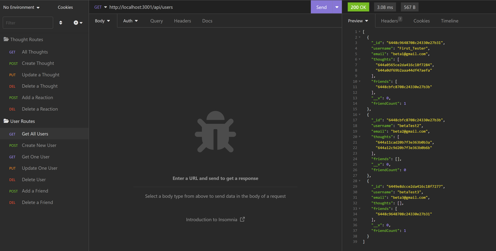
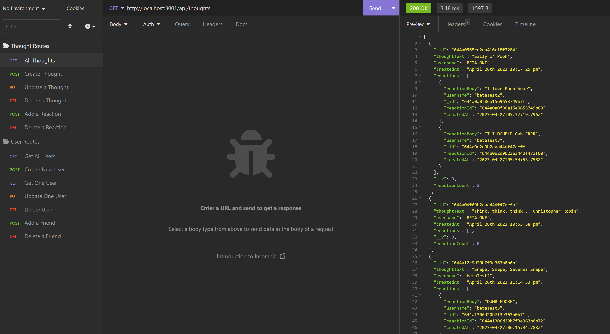
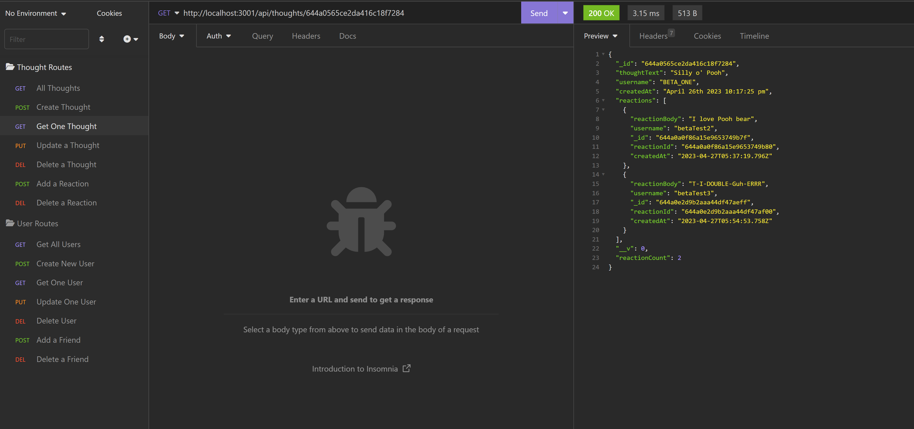

# MongoDBSocialNetworkAPI

## Table of Contents
  * [Description](#description)
  * [Installation](#installation)
  * [Usage](#usage)
  * [Licenses](#license)
  * [Contributing](#contributing)
  * [Credits](#credits)
    
## Description
This is a simple social network database utilizing MongoDB instead of SQL. This application can create new users, update users, delete users, add friends, remove friends, create thoughts, update thoughts, delete thoughts, add reactions to thoughts, and delete reactions to thoughts. Deleting a user will also delete everything associated with the user. 

## Installation
Please do an `npm i` prior to running the script.
Or individual packages:
`npm install mongoose`
`npm install express`
`npm install moment`
`npm install nodemon`

Lastly, run `node index.js` from root and open server on insomnia.

## Usage
Demo video link: https://drive.google.com/file/d/1gsordvWhuLHmTqKakBpDUPm64JkqF8Su/view

All Users:

All Thoughts:

One Single Thought:

## License
MIT License

## Contributing
Feel free to clone or fork the repo and create any changes you wish to make the application better!
